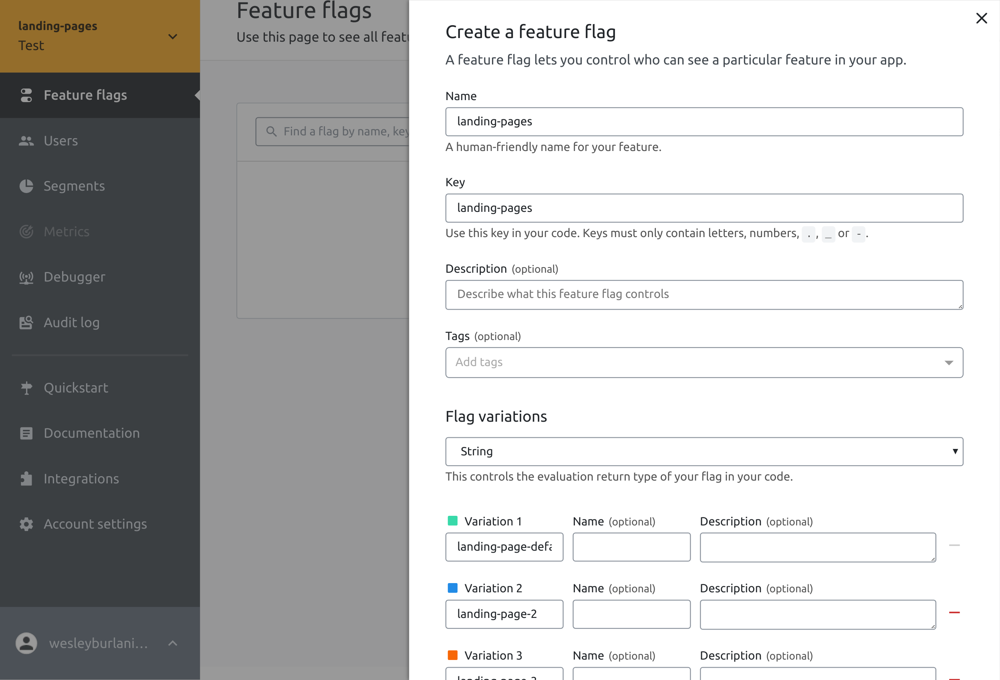

This project contains an example of [Launch Darkly](https://launchdarkly.com/) A/B test implementation in Typescript

Launch Darkly provides a node js SDK and the documentation could be found [here](https://docs.launchdarkly.com/sdk/client-side/node-js).

This project depends on:

### Dependencies ###

* [launchdarkly-node-client-sdk](https://launchdarkly.github.io/node-client-sdk/) npm package 

### How do I get set up? ###

To run this project locally, first of all you need to clone this repository, the project had the following requirements: 

#### Requirements ####

* npm
* webpack and webpack-dev
* docker
* docker compose
* ts-node

The second step its to run the folowing command to install launch darkly dependency:

```
npm install --save launchdarkly-node-client-sdk
```

After that, run the following command to generate an updated bundle: 

```
webpack
```

now you can run the following command to up your container: 

```
docker-compose up -d
```

The application will be accessible by the following url: http://launchdarkly.localtest.me/

### About the test ###

Since this example tests launch darkly features, the first thing you need to do its to create an account on [Launch Darkly](https://launchdarkly.com/). After that, access your account and go to "Account Settings" menu and click on "+Project" button to add a new project. 


Do not forget of mark "Make new flags available to client-side SDK's by default" option, since we gonna use the SDK. Click on "Save Project" button and you will be redirected to te following page: 


Save client-side-id of landing-pages project test environment. It would be used to access your Launch Darkly account on your code. It could be done with the followin script:

```typescript
LaunchDarkly.initialize(clientSideId, user);
```

At this snippet, we have "user" variable that identifies the current user. Since we gonna simulate some users visits, we can change our code to to something like that:


```typescript

let users = [
    { key: 'alice', },
    { key: 'bob', },
    { key: 'charlie', },
    { key: 'don', },
    { key: 'eli', },
    { key: 'fabio', },
    { key: 'gary', },
    { key: 'helen', },
    { key: 'ian', },
    { key: 'jill', },
];

users.forEach(user => { 
    LaunchDarkly.initialize(clientSideId, user);
    // do something
}); 
```

Now, we need to change our environment on launch darkly panel and access the test environment of landing-pages projects. After it, access "Feature flags" menu and click on "+Flag" button and create a flag like the following: 



Now, go to landing-pages feature flag and change default rule to serve a "percentage rollout" and divide equally by your variations. Do not forget of enable this target.


Now, lets run our first example, adding this snippet to our code: 

```typescript
let users = [
    { key: 'alice', },
    { key: 'bob', },
    { key: 'charlie', },
    { key: 'don', },
    { key: 'eli', },
    { key: 'fabio', },
    { key: 'gary', },
    { key: 'helen', },
    { key: 'ian', },
    { key: 'jill', },
];

users.forEach(user => { 
    LaunchDarkly.initialize(clientSideId, user);
    client.on('ready', () => {
        let variation = client.variation("landing-pages");
        if (variation === 'landing-page-default') {
            document.body.innerText += `Showing landing-default-1 for user ${user.key}` + '\n';
        } else if (variation === 'landing-page-2') {
            document.body.innerText += `Showing landing-page-2 for user ${user.key}` + '\n';
        } else if (variation === 'landing-page-3') {
            document.body.innerText += `Showing landing-page-3 for user ${user.key}` + '\n';
        } else {
            document.body.innerText += `Experiment disabled for user ${user.key}` + '\n';
        }
    });
}); 
```

The result of this snippet should be like that: 

```
Showing landing-default-1 for user alice
Showing landing-page-3 for user eli
Showing landing-page-2 for user don
Showing landing-page-3 for user charlie
Showing landing-default-1 for user fabio
Showing landing-default-1 for user bob
Showing landing-page-2 for user gary
Showing landing-page-2 for user ian
Showing landing-default-1 for user jill
Showing landing-default-1 for user helen
```

Until now, we have a feature where your variations are distributes across users. But we need to collect some relevant information about which users does some action and in wich variations.. To simulate it, we will try to collect wich users was converted to a lead. That simulation gonna use some random variable to decide if current user you be converted or not. Something like that: 

```typescript
let converted = !(+new Date()%2);
if(converted){
    document.body.innerText += `user ${user.key} is a lead!` + '\n';
    client.track('new_lead', { revenue: 1 });
}
```

Now, you can track this events by accessing LD panel on "Debugger Menu". 